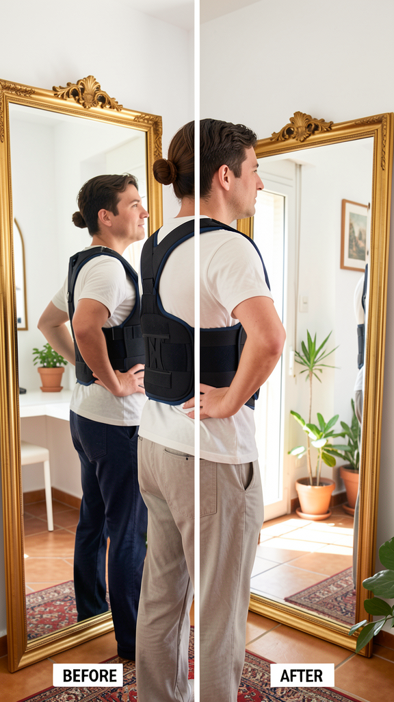

# ErgoFit — Tienda de Productos Ergonómicos



**ErgoFit** es una tienda Shopify especializada en productos para corregir la postura y aliviar el dolor de espalda. Este repositorio contiene la documentación del proyecto, la estrategia de marketing y los activos generados por el agente orquestador de IA.

## 🎯 Objetivo

Validar si un agente de IA puede generar tráfico orgánico y ventas en TikTok para una tienda nicho de dropshipping, automatizando:
- Investigación de productos
- Creación de contenido para redes sociales
- Publicación y seguimiento

## 📦 Productos

| Producto | Precio | 
|----------|--------|
| Corrector de Postura | €29,99 |
| Cojín Lumbar Memory Foam | €24,99 |
| Masajeador de Cuello Shiatsu con Calor | €38,99 |
| Soporte de Portátil Aluminio | €7,99 |
| Kit Básico (Corrector + Cojín) | €49,99 |
| Kit Completo (4 productos) | €89,99 |

**Tienda:** [ergofit-es.myshopify.com](https://ergofit-es.myshopify.com)

## 📁 Estructura del Proyecto

```
ergofit/
├── README.md                 ← Este archivo
├── docs/
│   ├── lean-canvas.md        ← Lean Canvas del modelo de negocio
│   ├── content-strategy.md   ← Estrategia TikTok (7 días)
│   └── experiments.md        ← Hipótesis y experimentos de validación
├── assets/
│   ├── images/               ← Imágenes generadas con IA
│   │   ├── frame-before-after.jpg
│   │   ├── frame-lumbar-support.jpg
│   │   └── frame-neck-massager.jpg
│   └── video/
│       └── tiktok-dia1-corrector.mp4  ← Video listo para publicar
└── .gitignore
```

## 📱 Estrategia de Contenido

Contenido orgánico para TikTok, 1 post al día:

| Día | Tipo | Producto |
|-----|------|----------|
| 1 | Antes/Después | Corrector de Postura |
| 2 | Educativo ("5 señales") | General |
| 3 | Review / Demostración | Cojín Lumbar |
| 4 | ASMR / Relajación | Masajeador de Cuello |
| 5 | Upsell: Kit Completo | Kit Completo |
| 6 | Testimonial | General |
| 7 | Tips + Producto | Corrector de Postura |

Ver detalle completo en [`docs/content-strategy.md`](docs/content-strategy.md).

## 🧪 Hipótesis a Validar

1. **🔴 Se puede conseguir tráfico orgánico en TikTok para tiendas nicho sin ads**
2. 🟡 Un agente de IA genera contenido de calidad suficiente para redes
3. 🟡 Los márgenes de dropshipping cubren costes y dejan beneficio
4. 🟢 Es posible encontrar productos ganadores vía IA
5. 🟢 Una persona sin experiencia técnica gestiona 3-5 tiendas con agentes

## ⚙️ Stack

- **Tienda:** Shopify
- **Proveedor dropshipping:** AliExpress / por definir
- **Redes:** TikTok (primario), IG (futuro)
- **IA Generativa:** Hermes Agent + Claude Sonnet + FAL (imágenes)
- **Repositorio:** GitHub

## 🚀 Próximos Pasos

- [ ] Publicar video Día 1 en TikTok
- [ ] Medir resultados (impresiones, clicks, ventas)
- [ ] Ajustar estrategia según datos
- [ ] Automatizar generación de contenido con agentes
- [ ] Escalar a más tiendas nicho

---

*Proyecto generado con [Hermes Agent](https://hermes-agent.nousresearch.com) + CTO Orchestrator Skill*
